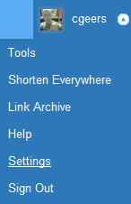
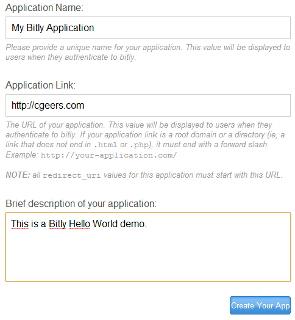
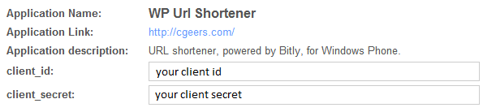
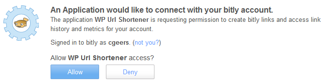

# Bitly API: Authentication

## Introduction

I was playing around this morning with the [Bitly API](http://dev.bitly.com/api.html). Like the [Dropbox API](https://github.com/geersch/DropboxRESTApi) they use [OAuth](http://oauth.net/) for authentication. But instead of version 1.0 they use the OAuth 2 draft specification.

Wondering how much it differs from the previous version I created a Bitly account and started coding...

## Register Your Application

If you don't have a Bitly account yet, then sign up here:

[http://bitly.com/a/sign_up](http://bitly.com/a/sign_up)

It's quick and painless, I promise.

Once signed up, you need to register your application. Just select your account's settings.



At the bottom you'll find a list of your registered OAuth applications. You are allowed to create 3 applications under a single Bitly account. Just click the Register OAuth Application button to register a new application.


First you need to request a registration code. This code will be sent to the e-mail address associated with your Bitly account. Go ahead and click the "Get Registration Code" button.

Once you have received the e-mail, click on the registration code within it. You'll be redirected to a form where you need to fill in the application's name, link and description.

For example:

]

After you've filled in the form and submitted it, your new application will be listed on your account. Per application you'll receive an application link, client id and client secret. You'll need these during the OAuth authentication process.



There seems no way to edit or remove a registered application afterwards. A pity.

## Authorization

Alright, Bitly account created, registered the application. Time to start the authentication process.

First you need to redirect the user to [https://bitly.com/oauth/authorize](https://bitly.com/oauth/authorize). You need to append your client id and application link (a.k.a. redirect uri) in the query string.

```csharp
var redirectUri = "http://cgeers.com/";
var uri = "https://bitly.com/oauth/authorize";

var authorizeUri = new StringBuilder(uri);
authorizeUri.AppendFormat("?client_id={0}&", clientId);
authorizeUri.AppendFormat("redirect_uri={0}", redirectUri);
```

You'll wind up with a URL that looks like this:

[https://bitly.com/oauth/authorize?client_id=your_client_id&redirect_uri=your_application_link](https://bitly.com/oauth/authorize?client_id=your_client_id&redirect_uri=your_application_link)

**Remark**: Make sure that the value of the redirect_uri parameter exactly matches the URL to which you linked your application! If you forget the last forward slash it will not work.

Now you need to redirect your user to this URL so that he or she can authorize your application.

A crude example:

```csharp
var startInfo = new ProcessStartInfo();
startInfo.FileName = authorizeUri.ToString();
Process.Start(startInfo);
```

The user will be redirect to a page where he can grant your applicion access to his Bitly account.



## Access Token

When the user authorizes your application, he will be redirected to the URL specified by the redirect_uri parameter. Bitly appends a code to this URI. You can exchange this code for an OAuth access token.

For example:

[http://cgeers.com/?code=ddc08e777c8e4d911fb24ab9c2cc19b640265bfe](http://cgeers.com/?code=ddc08e777c8e4d911fb24ab9c2cc19b640265bfe)

You need to retrieve the OAuth token using the [https://api-ssl.bitly.com/oauth/access_token](https://api-ssl.bitly.com/oauth/access_token) endpoint.

You'll need to append four parameters to it, namely:

- **client_id**: your application's Bitly client id
- **client_secret**: your application's Bitly client secret
- **code**: the code acquired via the authorization step
- **redirect_uri**: the page to which a user was redirected upon successfully authenticating

Let's compose this URL:

```csharp
var redirectUri = "http://cgeers.com/";
var code = "6c9f6ec95f54ba7269d0ba037b3eba7137559556";

var requestUri = new StringBuilder("https://api-ssl.bitly.com/oauth/access_token");
requestUri.AppendFormat("?client_id={0}&", clientId);
requestUri.AppendFormat("client_secret={0}&", clientSecret);
requestUri.AppendFormat("code={0}&", code);
requestUri.AppendFormat("redirect_uri={0}", redirectUri);
```

You'll end up with something like this:

[https://api-ssl.bitly.com/oauth/access_token?client_id=your_client_id&client_secret=your_client_secret&code=your_code&redirect_uri=your_app_uri](https://api-ssl.bitly.com/oauth/access_token?client_id=your_client_id&client_secret=your_client_secret&code=your_code&redirect_uri=your_app_uri)

Once again make sure that the values for all the parameters match exactly.

Now you'll need to issue a POST request (required), a GET request will not work, to obtain the response.

```csharp
var request = (HttpWebRequest) WebRequest.Create(requestUri.ToString());
request.Method = WebRequestMethods.Http.Post;

var response = request.GetResponse();
using (var reader = new StreamReader(response.GetResponseStream()))
{
    var accessToken = reader.ReadToEnd();
    //...
}
```

The response is a simple query string which will look something like this:

access_token=your_access_token&login=user_login&apiKey=users_api_key

Just split the string and extract the different parts.

```csharp
var parts = accessToken.Split('&');
var token = parts[0].Substring(parts[0].IndexOf('=') + 1);
var login = parts[1].Substring(parts[1].IndexOf('=') + 1);
var apiKey = parts[2].Substring(parts[2].IndexOf('=') + 1);
```

You now have an access token for the user. Make sure you persist it somewhere. You don't want to put the user through the authentication process again.

Once you've issued this request the code becomes useless. If you perform the request again using the same code you'll receive a 401 Http status code (unauthorized).

All Bitly API requests must be made over SSL ([https://api-sll.bitly.com/](https://api-sll.bitly.com/)). You can use the access token on behalf of the user. Perhaps I'll write another blog post that shows how to perform API requests. Stay tuned.
